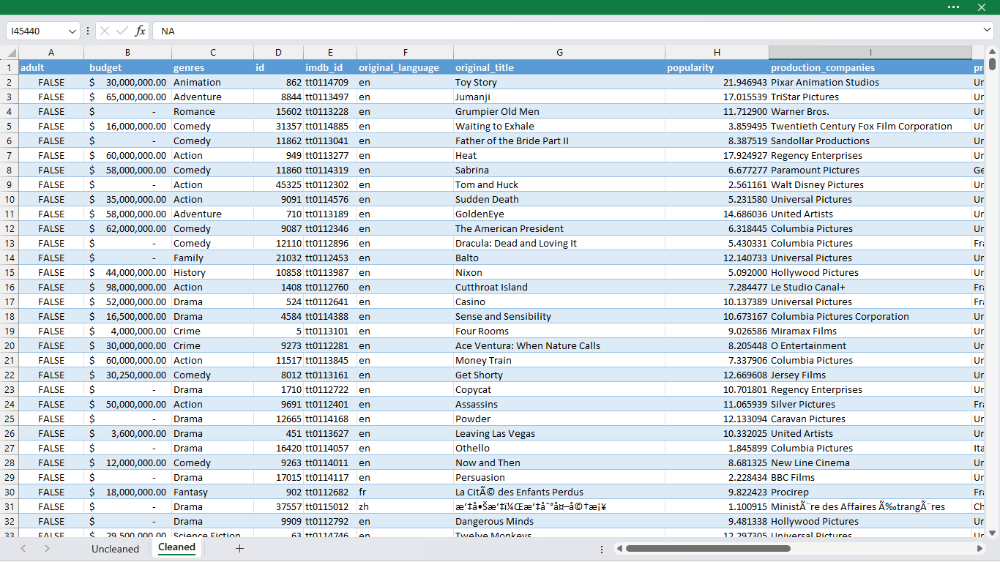

# Excel-Data-Cleaning-Movies-Dataset

# Project Overview

This document outlines the data cleaning process for the movies dataset using Excel.

## Data Sources

The movies dataset was sourced from [Kaggle](https://www.kaggle.com/datasets/rounakbanik/the-movies-dataset). It contains metadata for all 45,000 movies listed in the Full MovieLens Dataset, released on or before July 2017. 

## Tools

The data cleaning process was conducted using Microsoft Excel.

## Data Cleaning

The data cleaning process involved the following activities:

1. **Auto Fitting Columns**: Ensured that all data in each column is fully visible, preventing truncated data and facilitating easier analysis.

2. **Filling Empty Cells with NA**: Replaced empty cells with "NA" to standardize missing values, making it easier to identify and handle them during analysis.

3. **Removing Trailing and Leading Spaces**: Eliminated extra spaces before or after the text in cells, ensuring consistency and accuracy in data comparison and analysis.

4. **Removing Duplicates**: Identified and removed duplicate entries, preventing potential bias in analysis and ensuring accuracy in statistical calculations.

5. **Formatting**: Applied consistent formatting to data fields such as dates, currency, and text, enhancing readability and facilitating accurate analysis.

## Data Cleaning Comparison

### Before Data Cleaning (Uncleaned Data)

The snapshot of the uncleaned data reveals inconsistencies such as missing values in the 'budget' column, irregular formatting in the 'genres' column with nested dictionaries, and the presence of unnecessary columns like 'belongs_to_collection' and 'homepage'. Additionally, the 'revenue' column contains values represented with different formats, such as '-'. Overall, the data lacks uniformity and standardization, making it challenging to analyze effectively.

### After Data Cleaning (Cleaned Data)

In contrast, the cleaned data snapshot showcases a standardized and structured dataset. Notable improvements include:
- Filling empty cells with appropriate placeholders like 'NA' in the 'budget' column.
- Unpacking nested dictionaries and removing unnecessary columns like 'belongs_to_collection' and 'homepage'.
- Consistent formatting of numeric values in the 'revenue' column.
- Enhanced readability and usability for analysis purposes.

The cleaned data is now ready for further analysis and insights extraction, providing a reliable foundation for decision-making processes.
